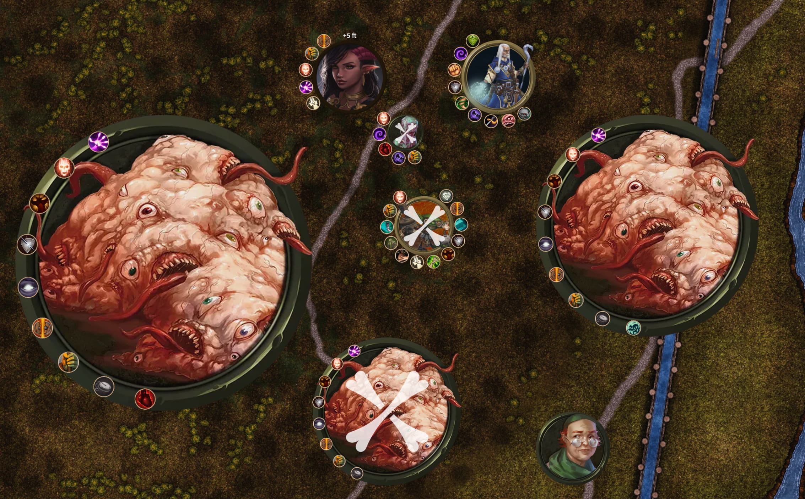
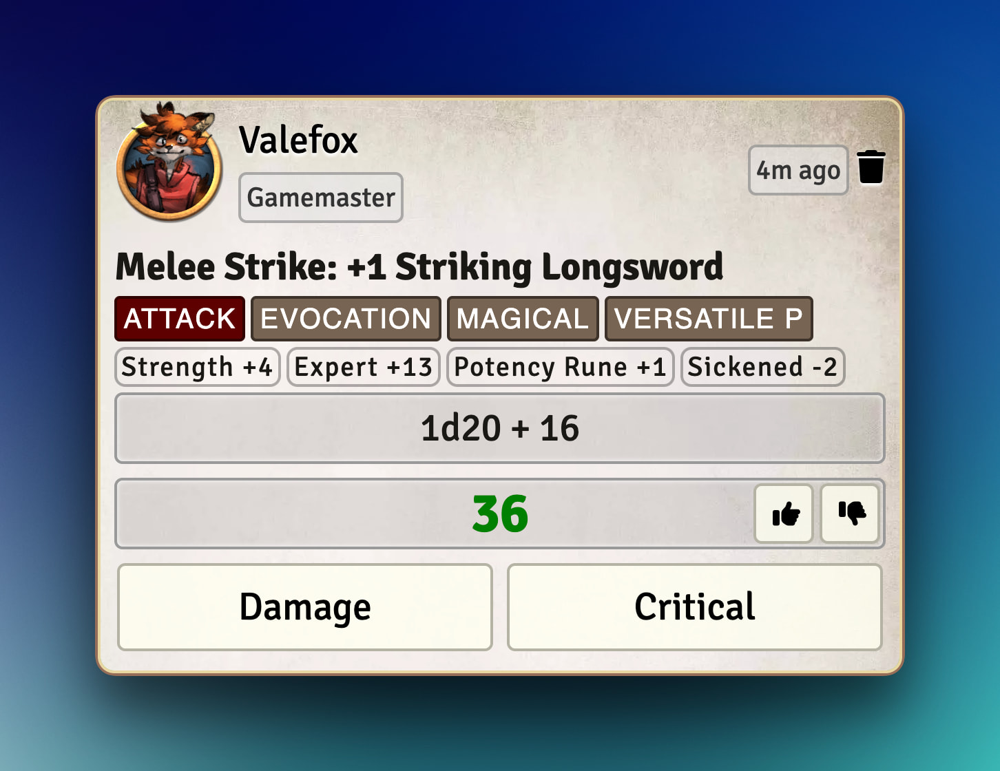
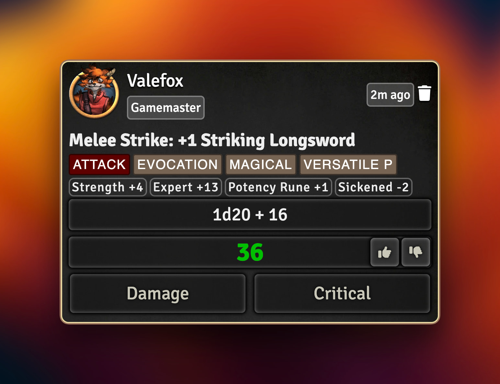
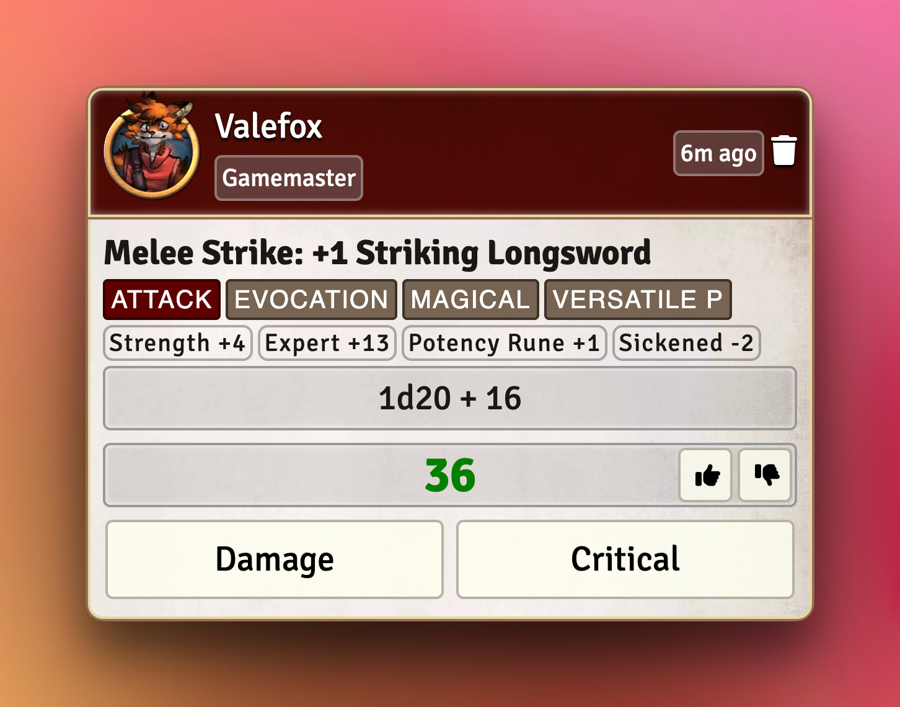
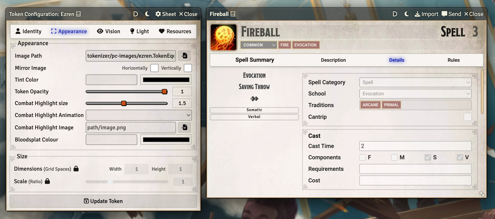
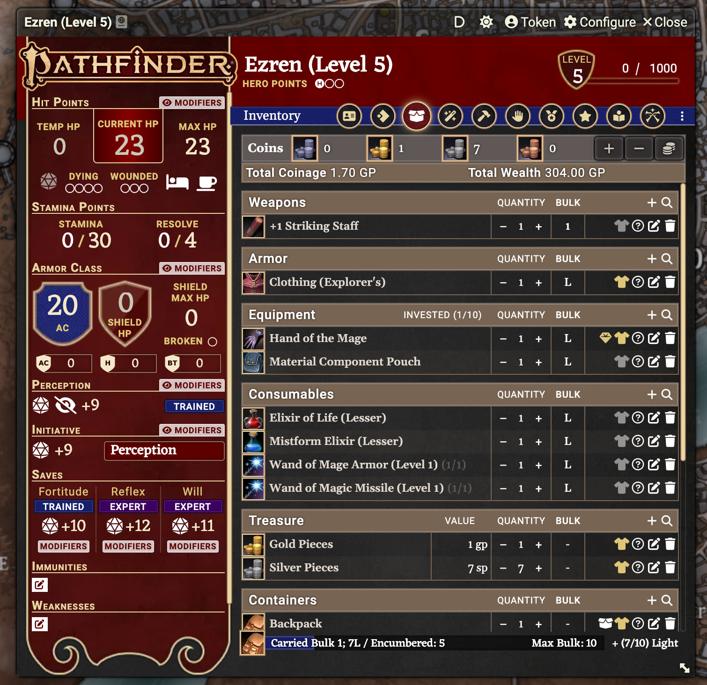
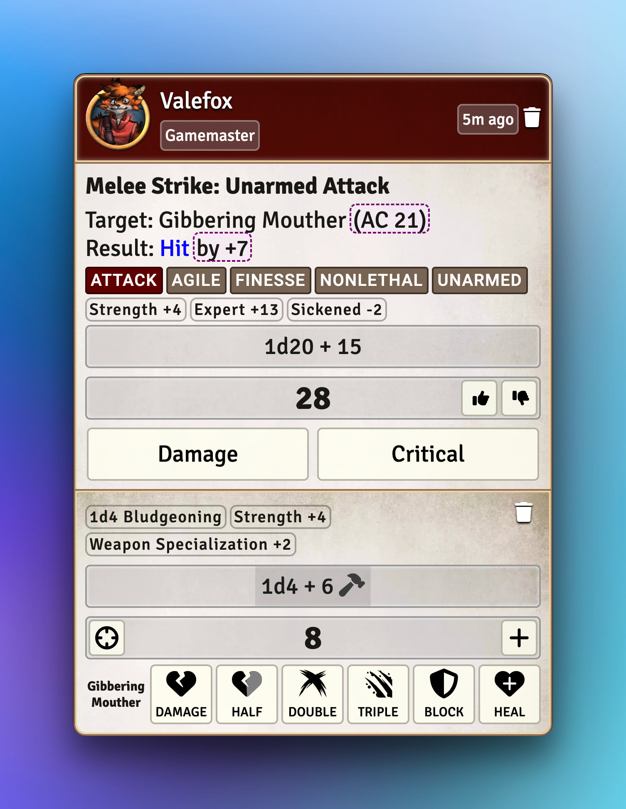
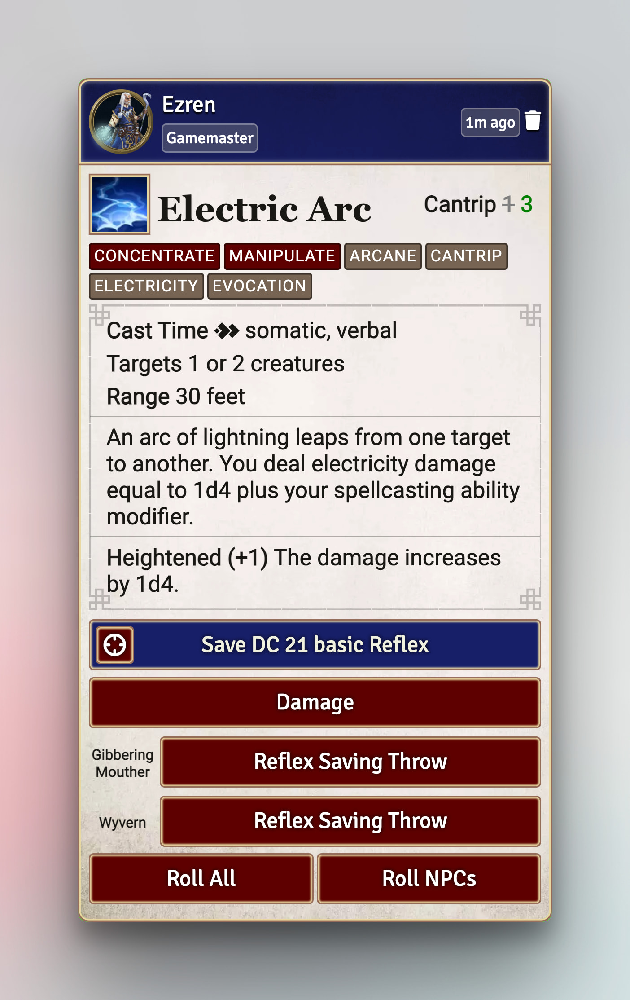
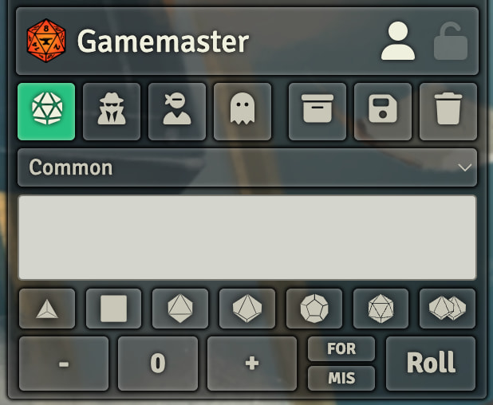

# PF2e Dorako UI

This is a UI overhaul for the Pathfinder 2nd Edition System for Foundry VTT, building upon the work of mdizo.

## Localization

<a href="https://weblate.foundryvtt-hub.com/engage/pf2e-dorako-ui/">

## Fresh coat of paint

This theme standardizes the Foundry UI, Pathfinder 2e System sheets, and all your modules (even popular macros!) to a pretty combination of glass, red, and blue.

All clickable elements react to :hover, with a quick, standardized transition.

### Foundry UI

Navigation, Controls, Hotbar, Sidebar

### Token Effects HUD

### Chat messages

#### A strike, using the light message theme

#### A strike, using the dark message theme

#### A strike, using the light message theme, with a red header

### Pathfinder 2e sheets and UI

#### Rework of all sorts of sheets and applications, for both light and dark UI theme

#### New themes for NPCs, Hazard, and Familiars

#### New dark theme for PC sheets

#### Effects rounded, panel also scrolls if needed

### Modules

#### A strike and a damage roll, merged using DFCE, with 'attack' traits removed from the damage roll to conserve space

#### Spell message with blue header, restructured to put important information up top, with PF2e Target Damage to add per-target buttons

#### Modules that live in the sidebar have explicit theme compatability. In this picture, PF2e Speaking As, DFCE, Polyglot, Dice Tray

#### Explicit styling for a bunch of ironkmonk's modules

Including "Active Tile Triggers", "Common Display", "Enhanced Journal", "Hotbar Expansion", "Little Details", "Scene Navigation", "TokenBar", etc.
Image shows a journal with Dalvyn's CRB styled journals enabled.

#### Token HUD with Monk's Little Details

#### Token Action HUD, both the old one and the new Core + Pathfinder one

## Features

Besides the theme, Dorako UI also has a bunch of UI-adjacent features, including:

- Use dark theme messages for GM and light theme for players
- Use the player color as the header color for messages
- Chat message avatars
  - Supports Token or Actor or Combatant images
  - Supports 'pop out' tokens (also for Combat Tracker)
  - Configurable size
  - Reacts to critical rolls, glowing green on a critical success, and dimming and desaturating for critical failures
  - Hidden when token is hidden, or roll is secret
- Chat message accesibility
  - Label indicating whispered messages and secret rolls
  - Label for Player names
- Chat message simplification
  - Pull important spellcasting information out of the footer and into the main message
  - Remove attack-related tags from damage rolls to save space
- Centered hotbar
  - Also works with modules that add extra hotbar rows
- Hide stuff you don't want to see
  - Foundry icon
  - Cards sidebar
  - Chat control icon
  - "Compact UI" mode that fades out UI when inactive
  - Collapse the Sidebar and/or Navigation by default
- Includes Dalvyn's CRB-styled journal theme

## Wide compatability

- Includes explicit theme support for 30+ modules.
- Warns you about compatability issues that can be fixed by changing settings in other modules, and gives you a one-click button to resolve the issues.
- Includes a system for marking applications as incompatible with dark theme (or _requiring_ dark theme in some cases)
- Includes a system to avoid affecting "Premium content journals".
  - All premium content modules with the exception of Beginner's Box and Abomination Vaults includes fancy Journal frames that should not be affected by Dorako UI.
  - All premium content journals, regardles of whether they have fancy frames, are marked as exempt from styling so they are unaffected by dark journal theme, or Dalvyn's CRB styling.
  - The system is easy to extend for future premium modules.

## Highly customizable

- Prefer a different color for the application chrome?
- Got a beefy PC and want the chrome to be frosted glass?
- Prefer _not_ to use Dorako UI for certain modules?
- Got a nitpicky feature request that isn't already a setting?

Dorako UI's custom settings menu allows you to configure the theme to your liking.
