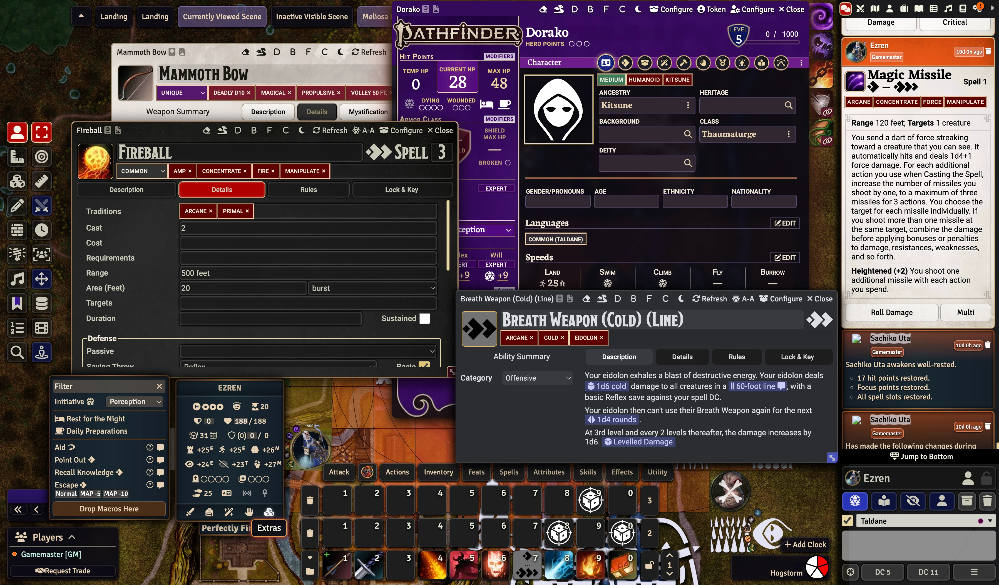

# PF2e Dorako UI

A UI overhaul for the Pathfinder 2nd Edition System for Foundry VTT.

If you and/or your players enjoy Dorako UI, consider supporting me on Ko-fi (all proceeds go towards pulling Honkai: Star Rail waifus).

## Localization

# Themes

Dorako UI has a powerful system to theming all aspects of the FVTT UI. Themes can be enabled or disabled to your preferences.

Dorako UI introduces three types of themes:

- Sheet themes
- Interface themes
- Chat message themes

#### Example

Pictured: A mishmash of available theme options.

## Sheet themes

These themes affect the look and feel of 'window' style applications and sheets.
Available themes include:

- **Core Rulebook/CRB** theme, inspired by the PF2e system sheets, building upon the work of mdizo. Available in light and dark color schemes.
- **Foundry2** theme, inspired by the design language introduced in Foundry 11.
- **Baldur's Gate 3** theme, inspired by the video game Baldur's Gate 3.
- **Discord** theme, inspired by the software of the same name. Available in light and dark color schemes.
- **D&D 5e** theme, inspired by the design language introduced in the v3 5e system. Requires the 5e system to be installed for certain assets to load.

## Interface themes

These themes affect the look and feel of 'UI' style applications such as the hotbar, scene navigation, the token HUD, and many modules.
Available themes include:

- **Glass** theme, the original 'Dorako UI' look. A refinement of default FVTT design using colors typical to Pathfinder.
- **Opaque** theme, for people who do not appreciate transparency.
- **Foundry2** theme.
- **Discord** theme.
- **BG3** theme.

## Chat Message themes

These themes affect the look and feel of chat messages.
A different theme can be applied to messages from the 'opposition', making enemy creatures feel visibly distinct. For example using a light color scheme for allies and a dark color scheme for enemies.
Available themes include:

- **Core Rulebook** light and dark theme, with an extra setting for header theme colors.
- **Foundry2** theme.
- **Baldur's Gate 3** brown and blue theme, inspired by the M&K and controller UI.
- **Discord** light and dark theme.
- **D&D 5e** light and dark theme.

## PC Sheet theme color

Player Character and Vehicle sheets provided by the PF2e system have a red banner. Dorako UI provides options for changing the 'theme color' to suit your preferences:

- Red
- Green
- Blue
- Purple
- Black

## Wide compatability

- Includes explicit theme support for 30+ modules.
- Warns you about compatability issues that can be fixed by changing settings in other modules, and gives you a one-click button to resolve the issues.
- Includes a system for excluding incompatible applications from theming.
- Includes a system for excluding journals provided by premium content modules from theming.

## Highly customizable

If you're feeling brave, Dorako UI includes 'Do It Yourself' theme options that are unstyled by the module, but are treated as real themes, and provide you all the affordances and integration of the themes provided by Dorako UI.
You can supply your own CSS to create a fully custom theme.

For smaller changes, Dorako UI includes a 'custom css' box for minor tweaks.

Check the [Wiki](https://github.com/Dorako/pf2e-dorako-ui/wiki) for more details.

## Features

Non-theme features have been moved to [Dorako UX](https://github.com/Dorako/pf2e-dorako-ux)

## Licenses & Attributions

This code is available under the MIT license, see LICENSE.

The green PC sheet theme is contributed by Vesselchuck.
